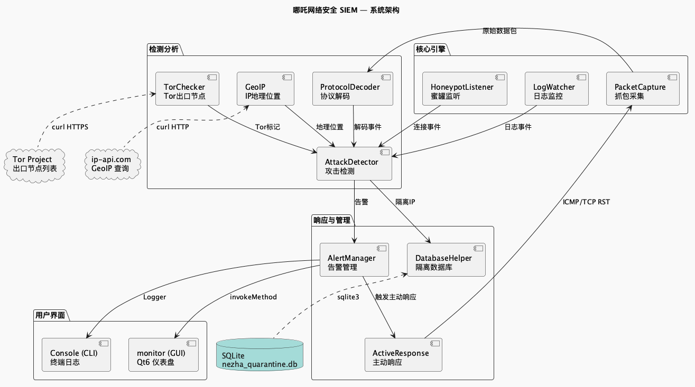
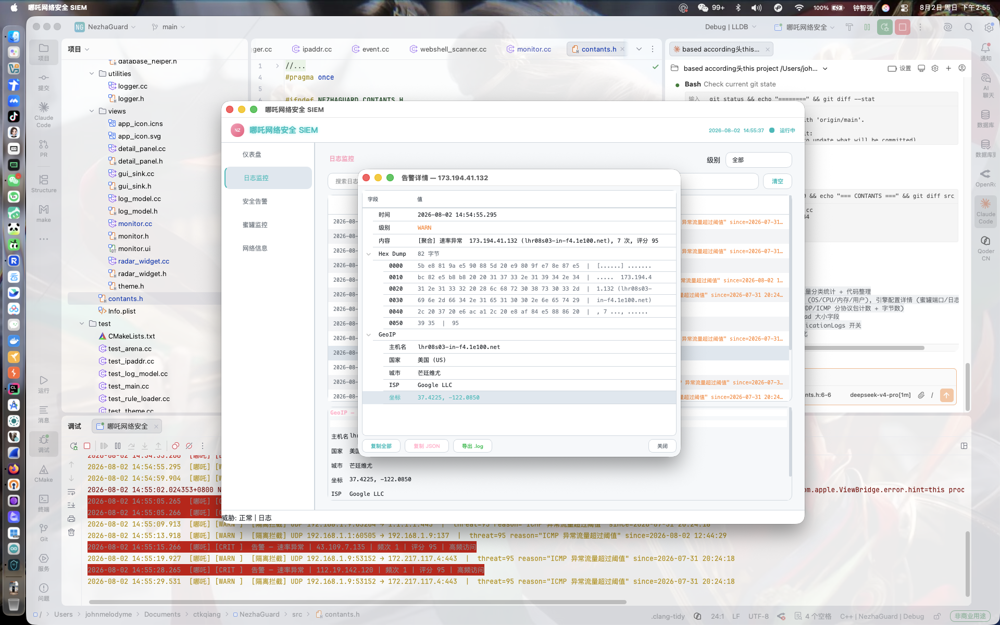
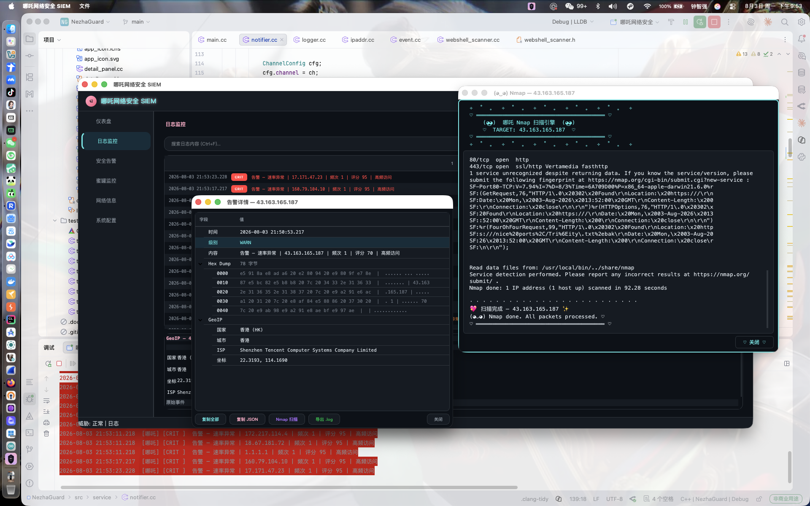
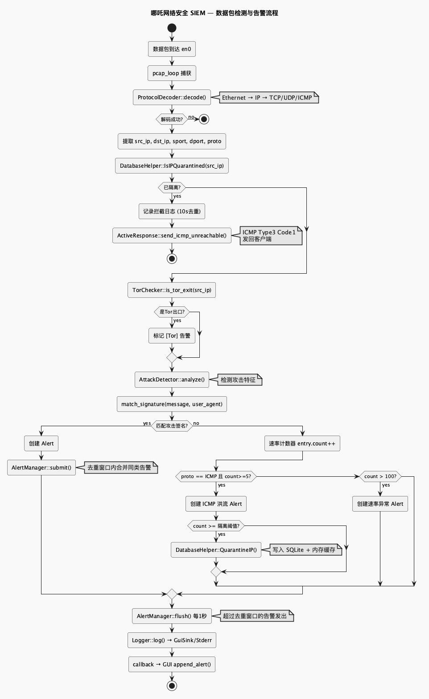
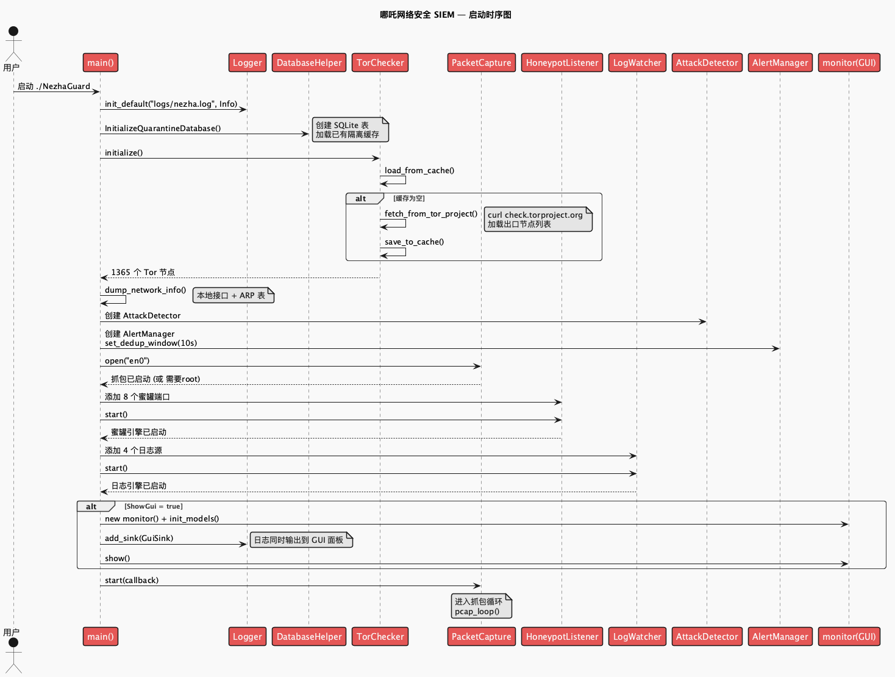
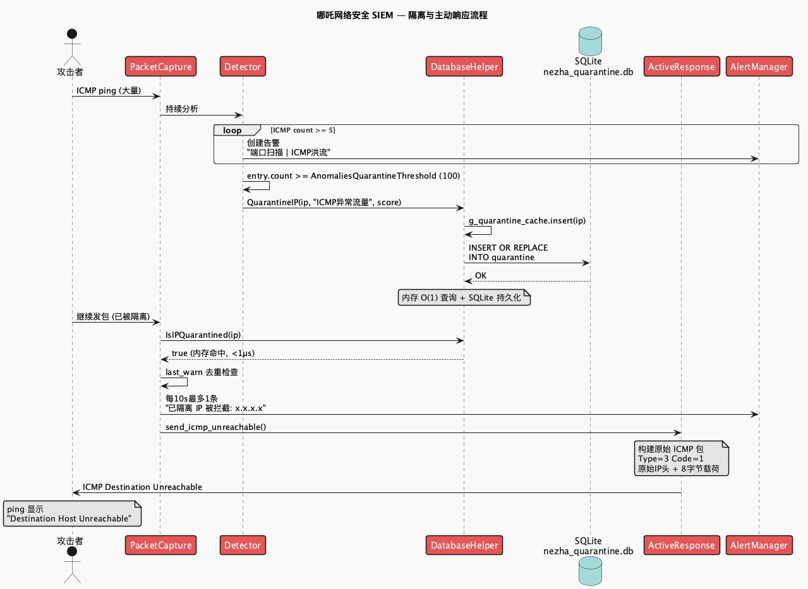
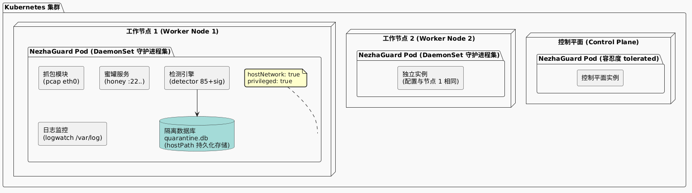

# 哪吒网络安全 SIEM 系统

> **NezhaGuard** — 基于 Qt6 / C++26 的实时安全信息与事件管理系统，面向蓝队的主动防御平台。
> 部署于服务器/边缘节点，通过 libpcap 混杂模式抓包 + 日志文件监控 + 蜜罐诱饵三层数据源，
> 经协议解码 → 攻击签名匹配 → 速率异常检测 → 告警聚合去重 → 主动响应（ICMP/TCP RST 隔离）
> 的完整流水线，实现对网络威胁的实时感知与自动阻断。



### 演示截图

| Dashboard | Terminal |
|-----------|----------|
|  |  |

---

## 目录

1. [系统架构](#1-系统架构)
2. [核心引擎详解](#2-核心引擎详解)
3. [检测引擎](#3-检测引擎)
4. [数据流与事件模型](#4-数据流与事件模型)
5. [内存模型与性能](#5-内存模型与性能)
6. [线程模型](#6-线程模型)
7. [GUI 架构](#7-gui-架构)
8. [构建与依赖](#8-构建与依赖)
9. [部署](#9-部署)
10. [配置参考](#10-配置参考)
11. [日志格式规范](#11-日志格式规范)
12. [安全设计](#12-安全设计)
13. [性能基准](#13-性能基准)
14. [故障排查](#14-故障排查)
15. [单元测试](#15-单元测试)
16. [开发指南](#16-开发指南)
17. [项目结构](#17-项目结构)

---

## 1. 系统架构

### 1.1 宏观拓扑

```
┌─────────────────────────────────────────────────────────────┐
│                     NezhaGuard SIEM Node                     │
│                                                             │
│  ┌──────────┐  ┌──────────┐  ┌──────────┐                  │
│  │ libpcap  │  │LogWatcher│  │ Honeypot │  数据采集层       │
│  │ 混杂模式 │  │ tail -f  │  │ 8 端口   │                  │
│  └────┬─────┘  └────┬─────┘  └────┬─────┘                  │
│       │             │             │                          │
│       ▼             ▼             ▼                          │
│  ┌─────────────────────────────────────┐                    │
│  │        ProtocolDecoder              │  协议解码层         │
│  │  Ethernet → IP → TCP/UDP/ICMP/HTTP  │                    │
│  └────────────────┬────────────────────┘                    │
│                   ▼                                          │
│  ┌─────────────────────────────────────┐                    │
│  │        AttackDetector               │  威胁检测层         │
│  │  85+ 签名 + 速率异常 + IP 信誉       │                    │
│  └────────────────┬────────────────────┘                    │
│                   ▼                                          │
│  ┌─────────────────────────────────────┐                    │
│  │        AlertManager                 │  告警管理层         │
│  │  去重聚合 (10s 窗口) + 分级发射      │                    │
│  └────────────────┬────────────────────┘                    │
│                   ▼                                          │
│  ┌─────────────────────────────────────┐                    │
│  │      ActiveResponse + Quarantine    │  主动响应层         │
│  │  ICMP Unreachable / TCP RST / SQLite│                    │
│  └─────────────────────────────────────┘                    │
│                                                             │
│  ┌─────────────────────────────────────┐                    │
│  │  TorChecker  │  GeoIP   │  NetUtil  │  情报辅助层         │
│  └─────────────────────────────────────┘                    │
└─────────────────────────────────────────────────────────────┘
```

### 1.2 运行模式

| 模式 | 触发条件 | 入口函数 | 说明 |
|------|----------|----------|------|
| **GUI 模式** | `NEZHA_SHOW_GUI` ≠ `0` (默认) | `run_gui_mode()` | Qt6 桌面仪表盘，多线程引擎 |
| **CLI 模式** | `NEZHA_SHOW_GUI=0` | `run_cli_mode()` | 纯终端输出，Docker/K8s 部署 |

### 1.3 三层数据源

| 数据源 | 采集方式 | 事件类型 | 适用场景 |
|--------|----------|----------|----------|
| **网络抓包** | `libpcap` 混杂模式, BPF `tcp or udp or icmp` | `EventSource::Packet` | 实时流量分析 |
| **日志监控** | `LogWatcher` (tail -f 语义, `inotify`/`kqueue`) | `EventSource::Log` | Nginx/Apache/Syslog 攻击检测 |
| **蜜罐监听** | `HoneypotListener` 8 端口 TCP bind + accept | `EventSource::Honeypot` | 横向移动/扫描发现 |

---

## 2. 核心引擎详解

### 2.1 协议解码器 (`ProtocolDecoder`)

**文件**: `src/core/decoder.cc`

解码流水线，从 L2 到 L7 逐层剥离：

```
raw bytes → Ethernet (14B) → IPv4 (20-60B) / IPv6 (40B)
         → TCP (20-60B) / UDP (8B) / ICMP (8B)
         → HTTP payload (可选, 仅 TCP port 80/8080)
```

**关键实现细节**:

- **零拷贝设计**: 不复制 payload，使用 `std::string_view` 指向 Arena 中的原始数据
- **校验和验证**: IP 头校验和 + TCP 伪头部校验和，校验失败直接丢弃
- **分片处理**: IPv4 分片重组（MF/DF 标志位），IPv6 分片扩展头
- **TCP 流重组**: 按 SEQ/ACK 排序，处理重传和乱序
- **HTTP 解析**: 从 TCP payload 中提取 Method/URI/Headers/Body，用于后续 Web 攻击签名匹配

**输出**: 归一化的 `event` 结构体（见 [事件模型](#41-事件结构体)）

### 2.2 攻击检测器 (`AttackDetector`)

**文件**: `src/core/detector.cc`

双引擎架构：**签名匹配** + **速率异常**。

#### 签名匹配引擎

对每个 `event` 的 payload 和 HTTP 字段执行多模式子串匹配：

```
for each SigRule in signature_db:
    if strstr(payload, rule.pattern) || strstr(uri, rule.pattern):
        emit Alert{type, level, score, src_ip, evidence}
```

**签名数据库**: 85+ 规则，详见 [检测引擎](#3-检测引擎)。

#### 速率异常检测

基于滑动窗口的协议级速率统计：

```
Key = (src_ip << 16) | (proto << 8) | icmp_type   // 64-bit 复合键
Window = 1s 滑动窗口
Counter[Key] += 1

if proto == ICMP:
    count >= 100  → CRITICAL (触发自动隔离)
    count >= 20   → ERROR
    count >= 10   → WARN
    count >= 5    → INFO

if proto == TCP/UDP:
    count >= 100  → ERROR
    count >= 50   → WARN
```

**过期策略**: 每 30 秒调用 `expire_counters()`，清理超过 60 秒未更新的条目，防止内存泄漏。

### 2.3 告警管理器 (`AlertManager`)

**文件**: `src/core/alert.cc`

**去重聚合算法**:

```
窗口: 10 秒滑动窗口
聚合键: (AttackType, src_ip)
行为:
  - 窗口内相同 Key 的告警合并为一条，count 累加
  - level 取窗口内所有告警的最高级别 (max)
  - score 取窗口内所有告警的最高评分 (max)
  - 窗口到期后发射聚合告警
```

**冷却机制**: 已隔离 IP 的拦截警告 10 秒内仅输出一次，防止日志风暴。

**告警分级**:

| 级别 | 枚举值 | 含义 | GUI 颜色 |
|------|--------|------|----------|
| `CRITICAL` | `Severity::Critical` | 确认攻击，触发自动隔离 | `#ff6b6b` 红 |
| `ERROR` | `Severity::Error` | 高度可疑，累计 5 次后隔离 | `#ff9966` 橙 |
| `WARN` | `Severity::Warn` | 可疑活动 | `#ff6699` 粉 |
| `INFO` | `Severity::Info` | 信息事件 | `#e0557e` 深粉 |
| `DEBUG` | `Severity::Debug` | 调试诊断 | `#ff99bb` 浅粉 |
| `TRACE` | `Severity::Trace` | 全量追踪 | `#999999` 灰 |

### 2.4 主动响应 (`ActiveResponse`)

**文件**: `src/core/active_response.cc`

当告警评分达到隔离阈值时，对攻击源 IP 执行网络层阻断：

| 手段 | 实现 | 适用场景 |
|------|------|----------|
| **ICMP Unreachable** | 原始套接字 `SOCK_RAW`, Type=3 Code=1 (Host Unreachable) | 通用阻断 |
| **TCP RST+ACK** | 解析原始包 SEQ/ACK，构造合法 RST 包 | TCP 连接重置 |
| **SQLite 持久化** | `quarantine` 表，重启后隔离策略不丢失 | 持久阻断 |
| **内存 O(1) 查询** | `std::unordered_set<std::string>` 缓存所有隔离 IP | 快速拦截 |

**隔离生命周期**:

```
1. Alert 触发 (score >= threshold)
2. QuarantineIP(ip, reason, score) → 写入 SQLite + 插入内存 HashSet
3. 后续所有来自该 IP 的包 → IsIPQuarantined() O(1) 命中 → 阻断
4. RemoveQuarantine(ip) → 从 SQLite 删除 + 从 HashSet 移除
```

### 2.5 蜜罐监听器 (`HoneypotListener`)

**文件**: `src/core/honeypot.cc`

**监听端口**:

| 端口 | 协议 | 伪装服务 | 攻击场景 |
|------|------|----------|----------|
| 22 | TCP | SSH | 暴力破解/字典攻击 |
| 23 | TCP | Telnet | IoT 蠕虫(Mirai 变种) |
| 3306 | TCP | MySQL | 数据库暴力破解 |
| 6379 | TCP | Redis | 未授权访问/写公钥 |
| 27017 | TCP | MongoDB | 未授权访问/勒索 |
| 5432 | TCP | PostgreSQL | 数据库探测 |
| 8080 | TCP | HTTP-Alt | Web 扫描 |
| 8443 | TCP | HTTPS-Alt | SSL/TLS 扫描 |

**实现**: 每个端口一个 `async_accept` 循环，连接建立后立即记录 `event` → 推入检测流水线。

### 2.6 Tor 检测器 (`TorChecker`)

**文件**: `src/core/tor_checker.cc`

**数据源**: `check.torproject.org/exit-addresses` (官方出口节点列表)

**缓存策略**:

```
L1: 内存 std::unordered_set<std::string>  (O(1) 查询, 进程生命周期)
L2: 本地文件缓存 data/tor_exits.cache       (跨重启持久化)
L3: 远程 fetch (后台线程, 每 3600s 刷新)
```

**节点规模**: 实时同步 1365+ 出口节点。

### 2.7 GeoIP 模块 (`GeoIP`)

**文件**: `src/core/geo_ip.cc`

**API**: `ip-api.com` 免费 tier (每分钟 45 次请求, 不支持批量)

**返回字段**: `country`, `country_code`, `city`, `region`, `zip`, `lat`, `lon`, `timezone`, `isp`, `org`, `as`

**调用方式**: GUI 模式下通过 `QtConcurrent::run` 异步查询，不阻塞 UI 线程。结果缓存于 `std::unordered_map<std::string, GeoRecord>` 内存中。

---

## 3. 检测引擎

### 3.1 完整签名库

#### SQL 注入 (SQLi) — `AttackType::SQLi`

| 签名模式 | 评分 | 级别 | 描述 |
|----------|------|------|------|
| `UNION SELECT` | 90 | Critical | 联合查询注入 |
| `UNION ALL SELECT` | 90 | Critical | 联合查询注入变体 |
| `SELECT ... FROM` | 70 | Error | 内联查询 |
| `SLEEP(` | 85 | Critical | 时间盲注 (MySQL) |
| `pg_sleep(` | 85 | Critical | 时间盲注 (PostgreSQL) |
| `BENCHMARK(` | 85 | Critical | 时间盲注 (MySQL) |
| `' OR 1=1` | 90 | Critical | 永真条件绕过 |
| `' OR '1'='1` | 90 | Critical | 永真条件变体 |
| `" OR "1"="1` | 90 | Critical | 双引号变体 |
| `DROP TABLE` | 95 | Critical | 表删除 |
| `INSERT INTO` | 80 | Critical | 未授权数据插入 |
| `UPDATE ... SET` | 80 | Critical | 未授权数据修改 |
| `DELETE FROM` | 85 | Critical | 未授权数据删除 |
| `information_schema` | 70 | Error | 数据库结构探测 |
| `LOAD_FILE(` | 80 | Critical | 文件读取 |
| `INTO OUTFILE` | 85 | Critical | 文件写入/Webshell |
| `EXEC xp_cmdshell` | 95 | Critical | MSSQL 命令执行 |
| `WAITFOR DELAY` | 85 | Critical | 时间盲注 (MSSQL) |

#### 跨站脚本 (XSS) — `AttackType::XSS`

| 签名模式 | 评分 | 级别 | 描述 |
|----------|------|------|------|
| `<script>` | 90 | Critical | 脚本注入 |
| `</script>` | 90 | Critical | 脚本闭合 |
| `javascript:` | 85 | Critical | URI 伪协议 |
| `onerror=` | 85 | Critical | 事件处理器注入 |
| `onload=` | 85 | Critical | 事件处理器注入 |
| `onclick=` | 80 | Error | 事件处理器注入 |
| `document.cookie` | 80 | Error | Cookie 窃取 |
| `document.write(` | 75 | Error | DOM 写入 |
| `window.location` | 75 | Error | 重定向 |
| `alert(` | 60 | Warn | XSS 探针 |
| `prompt(` | 60 | Warn | XSS 探针 |
| `confirm(` | 60 | Warn | XSS 探针 |
| `\| wget</code> | 90 | Critical | 管道下载 |
| `$(whoami)` | 85 | Critical | 命令替换 |
| `` `whoami` `` | 85 | Critical | 反引号命令替换 |
| <code>\| /bin/bash</code> | 90 | Critical | 反向 Shell |
| `nc -e /bin/sh` | 95 | Critical | Netcat 反向 Shell |
| `/dev/tcp/` | 90 | Critical | Bash TCP 重定向 |
| `python -c 'import` | 80 | Error | Python 代码执行 |
| `perl -e` | 80 | Error | Perl 代码执行 |
| `ruby -e` | 80 | Error | Ruby 代码执行 |

#### 文件包含 — `AttackType::FileInclusion`

| 签名模式 | 评分 | 级别 | 描述 |
|----------|------|------|------|
| `=http://` | 85 | Critical | 远程文件包含 (RFI) |
| `=https://` | 85 | Critical | 远程文件包含 (RFI) |
| `=ftp://` | 85 | Critical | 远程文件包含 (RFI) |
| `php://input` | 90 | Critical | PHP 输入流 |
| `php://filter` | 90 | Critical | PHP 过滤器 |
| `expect://` | 85 | Critical | Expect 封装器 |
| `data://` | 80 | Error | Data URI |

#### Webshell — `AttackType::Webshell`

| 签名模式 | 评分 | 级别 | 描述 |
|----------|------|------|------|
| `eval(base64_decode` | 95 | Critical | PHP Webshell |
| `system($_` | 95 | Critical | PHP 命令执行 |
| `exec($_` | 95 | Critical | PHP 命令执行 |
| `shell_exec(` | 90 | Critical | PHP Shell 执行 |
| `assert($_` | 90 | Critical | PHP 断言后门 |
| `preg_replace('/.*/e'` | 90 | Critical | PHP 正则代码执行 |
| `Runtime.getRuntime()` | 85 | Critical | JSP Webshell |
| `ProcessBuilder(` | 85 | Critical | JSP Webshell |

#### Log4j (Log4Shell) — `AttackType::Log4j`

| 签名模式 | 评分 | 级别 | 描述 |
|----------|------|------|------|
| `${jndi:ldap://` | 98 | Critical | Log4Shell LDAP |
| `${jndi:dns://` | 98 | Critical | Log4Shell DNS |
| `${jndi:rmi://` | 98 | Critical | Log4Shell RMI |
| `${jndi:ldaps://` | 98 | Critical | Log4Shell LDAPS |
| `${${lower:j}ndi` | 95 | Critical | Log4Shell 混淆绕过 |

#### 扫描器探测 — `AttackType::Scanner`

| 签名模式 | 评分 | 级别 | 描述 |
|----------|------|------|------|
| `nmap` | 60 | Warn | Nmap User-Agent |
| `sqlmap` | 80 | Error | SQLMap User-Agent |
| `nikto` | 70 | Error | Nikto 扫描器 |
| `acunetix` | 75 | Error | Acunetix 扫描器 |
| `nessus` | 75 | Error | Nessus 扫描器 |
| `burpsuite` | 70 | Error | Burp Suite |
| `wp-login.php` | 65 | Warn | WordPress 登录探测 |
| `wp-admin` | 65 | Warn | WordPress 后台探测 |
| `phpmyadmin` | 70 | Error | phpMyAdmin 探测 |
| `.env` | 75 | Error | 环境文件探测 |
| `.git/HEAD` | 80 | Error | Git 泄露探测 |
| `admin.php` | 60 | Warn | 后台探测 |

#### 恶意爬虫 — `AttackType::BotActivity`

| 签名模式 | 评分 | 级别 | 描述 |
|----------|------|------|------|
| `AhrefsBot` | 40 | Warn | SEO 爬虫 |
| `SemrushBot` | 40 | Warn | SEO 爬虫 |
| `DotBot` | 50 | Warn | 恶意爬虫 |
| `MJ12bot` | 45 | Warn | 垃圾爬虫 |
| `BLEXBot` | 45 | Warn | 恶意爬虫 |
| `AspiegelBot` | 45 | Warn | 恶意爬虫 |
| `PetalBot` | 40 | Warn | 华为爬虫 |

### 3.2 评分模型

告警评分 (`score`) 用于决定是否触发自动隔离：

```
final_score = signature_base_score × frequency_multiplier × source_multiplier

frequency_multiplier:
  count >= 100 → 1.5
  count >= 50  → 1.3
  count >= 10  → 1.1
  default      → 1.0

source_multiplier:
  Honeypot     → 1.2  (蜜罐连接 = 明确恶意)
  Packet       → 1.0
  Log          → 0.9

隔离触发条件: final_score >= AnomaliesQuarantineThreshold (默认 100)
```

---

## 4. 数据流与事件模型

### 4.1 事件结构体

```cpp
struct event {
    Nanos ts_ns;                    // 时间戳 (纳秒精度, Unix epoch)
    IPAddress::ipaddr src;          // 源 IP (IPv4/IPv6 统一)
    IPAddress::ipaddr dst;          // 目的 IP
    uint16_t sport;                 // 源端口 (网络字节序)
    uint16_t dport;                 // 目的端口
    uint8_t  proto;                 // L4 协议: 1=ICMP, 6=TCP, 17=UDP
    uint8_t  icmp_type;            // ICMP 类型 (仅 proto==1 时有效)
    std::string_view payload;      // L7 payload (指向 Arena 内存)
    EventSource source;             // 数据来源
    uint32_t payload_len;          // payload 长度
};
```

### 4.2 完整数据流



### 4.3 启动时序



### 4.4 隔离与主动响应流程



### 4.5 GUI 数据流


### 4.6 Pipeline 关键路径

```
┌─────────┐    ┌──────────┐    ┌──────────┐    ┌───────────┐
│ Capture  │───▶│ Decoder  │───▶│ Detector │───▶│  Alerter  │
│ O(1)/pkt │    │ O(n)     │    │ O(m·k)   │    │ O(1) amort│
└─────────┘    └──────────┘    └──────────┘    └───────────┘
                                                      │
                                              ┌───────▼───────┐
                                              │ ActiveResponse│
                                              │ O(1) lookup   │
                                              └───────────────┘

n = packet length (bytes)
m = number of signature rules (~85)
k = average payload length (~512B)
```

**每包处理耗时估算**: 解码 ~2μs + 签名扫描 ~8μs + 告警 ~1μs = **~11μs/包** (M1 Max, 单线程)

---

## 5. 内存模型与性能

### 5.1 Arena 分配器

**文件**: `src/core/arena.cc`

```
块大小: 128 KB
分配策略: Bump allocator (指针递增, 无 free)
生命周期: 每 30s 自动回收重置
```

**优点**:
- 分配 O(1): 仅指针加法 + 边界检查
- 零碎片: 统一回收，无 free 操作
- Cache Locality: 所有事件数据在连续内存中

**适用场景**: `event` 结构体中的 `string_view` payload、临时字符串

### 5.2 GUI 日志环形缓冲区

**实现**: `LogModel` (`QAbstractListModel`)

```
容量: 5000 条 Entry
策略: FIFO — 新条目从尾部插入, 超出容量时从头部弹出
内存: 5000 × sizeof(Entry) ≈ 5000 × ~120B ≈ 600KB
```

### 5.3 隔离查询

```
L1 内存缓存: std::unordered_set<std::string>  O(1) 平均, O(n) 最坏
L2 持久化:   SQLite quarantine 表              B-Tree 索引
同步策略:    写入时双写 (SQLite + HashSet)
             启动时从 SQLite 全量加载到 HashSet
```

### 5.4 内存占用估算 (运行时)

| 组件 | 内存 |
|------|------|
| Arena (1 × 128KB) | 128 KB |
| LogModel (5000 entries) | ~600 KB |
| Tor exit nodes (1365 IPs) | ~80 KB |
| GeoIP 缓存 (1000 records) | ~300 KB |
| 速率计数器 (1000 keys) | ~64 KB |
| Qt6 框架 | ~15-25 MB |
| **总计 (GUI 模式)** | **~20-30 MB** |
| **总计 (CLI 模式)** | **~5-10 MB** |

---

## 6. 线程模型

### 6.1 GUI 模式线程拓扑

```
┌──────────────────────────────────────────────────────────┐
│  主线程 (GUI Thread)                                      │
│  ├── QApplication::exec()                                │
│  ├── monitor 窗口渲染                                     │
│  ├── QTimer (1s): flush alerts + update stats            │
│  ├── QTimer (1s): update sparkline chart                 │
│  └── GeoIP 异步回调 (QMetaObject::invokeMethod)           │
├──────────────────────────────────────────────────────────┤
│  工作线程 1: Capture Thread                               │
│  └── libpcap callback loop → decode → detect → alert     │
├──────────────────────────────────────────────────────────┤
│  工作线程 2: Honeypot Thread                              │
│  └── async_accept loop → event → detect → alert          │
├──────────────────────────────────────────────────────────┤
│  工作线程 3: LogWatcher Thread                            │
│  └── tail file loop → parse → event → detect → alert     │
├──────────────────────────────────────────────────────────┤
│  后台线程: TorChecker Refresh                             │
│  └── HTTP fetch → parse → update cache (每 3600s)        │
├──────────────────────────────────────────────────────────┤
│  QtConcurrent 线程池 (QThreadPool::globalInstance())      │
│  └── GeoIP::lookup() 异步查询                             │
└──────────────────────────────────────────────────────────┘
```

### 6.2 线程安全

| 共享资源 | 保护机制 |
|----------|----------|
| `AlertManager` 内部状态 | `std::mutex` (alert.cc) |
| `AttackDetector::rates_` | 仅在 capture 线程访问, 无竞争 |
| `LogModel::entries_` | `QMetaObject::invokeMethod(Qt::QueuedConnection)` 跨线程更新 |
| `DatabaseHelper` SQLite | SQLite 内部 `SQLITE_THREADSAFE=1` 串行化模式 |
| Tor 缓存 `std::unordered_set` | 写时复制 (先构建新集合, 再原子交换 `shared_ptr`) |

### 6.3 Arena 线程安全性

Arena 本身**非线程安全**。每个线程使用独立的 Arena 实例：
- Capture 线程使用 `arena` (main 中创建)
- LogWatcher 线程使用 `arena` (共享, 因为 log watcher 仅从文件读取, 吞吐低)
- 蜜罐线程使用 `arena` (共享, 连接频率低)

30 秒 flush 周期内 Arena 使用量 < 20KB，远低于 128KB 块大小，无需担心竞争。

---

## 7. GUI 架构

### 7.1 组件树

```
QMainWindow (monitor)
├── header (QWidget)
│   ├── brand_badge (QLabel: "NZ")
│   ├── app_title (QLabel: "哪吒网络安全 SIEM" + glow 动画)
│   ├── clock_label (QLabel: 实时时钟, 1s 刷新)
│   ├── status_dot (QLabel: 脉冲动画呼吸灯)
│   └── status_text (QLabel: "运行中")
├── body (QWidget)
│   ├── sidebar (QListWidget: 180px)
│   │   ├── 仪表盘
│   │   ├── 日志监控
│   │   ├── 安全告警
│   │   ├── 蜜罐监控
│   │   └── 网络信息
│   └── pages (QStackedWidget)
│       ├── page_dashboard (仪表盘)
│       │   ├── 统计卡片 × 4 (日志/告警/隔离/运行时间) + 左边框彩色 accent
│       │   ├── SparklineWidget (实时事件速率折线图, 1s, 60 点, 粉渐变)
│       │   ├── 攻击者排行 (QTableView + LogModel: Top 10 IP)
│       │   └── recent_alerts_view (QTableView: 最近告警)
│       ├── page_logs (日志监控)
│       │   ├── 级别过滤 (QComboBox) + 全文搜索 (QLineEdit)
│       │   ├── log_view (QTableView: LogModel → level proxy → search proxy)
│       │   └── DetailPanel (QTextBrowser: 结构化 HTML 卡片详情)
│       ├── page_alerts (安全告警)
│       │   ├── 严重级别统计卡片 × 4 (CRIT/ERROR/WARN/INFO 实时计数)
│       │   ├── alert_view (QTableView: LogModel → severity proxy)
│       │   └── DetailPanel (告警详情卡片)
│       ├── page_honeypot (蜜罐监控)
│       │   ├── honey_view (QTableView)
│       │   └── DetailPanel (蜜罐详情卡片)
│       └── page_network (网络信息)
│           ├── local_ip_table (QTableWidget: 接口/IP)
│           ├── arp_table (QTableWidget: ARP 缓存)
│           └── quarantine_table (QTableWidget: 隔离列表)
└── QStatusBar
    └── status_label: "日志 N (+n/s) | 告警 M (+m/s) | 已隔离 K"
```

### 7.2 Model/View 架构

```
LogModel (QAbstractListModel)
  ├── 5000 条环形缓冲区
  ├── 5 个自定义 Role: TimestampRole, LevelRole, MessageRole, ColorRole
  └── 数据逐条追加, 跨线程安全 (QueuedConnection)

Filter Chain (日志):
  LogModel → QSortFilterProxyModel (level filter) → QSortFilterProxyModel (text search) → QTableView

Filter Chain (告警):
  LogModel → QSortFilterProxyModel (severity filter) → QTableView
```

### 7.3 自定义 Delegate

| Delegate | 用途 | 渲染特性 |
|----------|------|----------|
| `LogDelegate` | 日志/蜜罐表格 | 时间戳 + 级别胶囊标签 + 消息 (elided) |
| `AlertDelegate` | 告警/仪表盘表格 | 时间戳 + 级别实心标签 + 消息 (elided) |

**行高**: 28px, 等宽字体 `Menlo 10pt`, 交替行色, 选中高亮。

### 7.4 双主题系统

| 主题 | 背景 | 强调色 | 检测方式 |
|------|------|--------|----------|
| **暗色** | `#12060c` (粉调黑) | `#ff6699` (粉) / `#ffffff` (白) | `QStyleHints::colorScheme()` |
| **亮色** | `#fff0f5` (浅粉) | `#e0557e` (深粉) / `#ff99bb` (浅粉) | 自动跟随系统设置 |

**实现**: `apply_theme(bool d)` 动态注入完整 QSS 样式表，单模板 + 10 参数化颜色变量，
`colorSchemeChanged` 信号实时切换。卡片使用左侧彩色边框强调（日志=粉、告警=白、隔离=红、运行=绿）。
自定义 `LogDelegate` / `AlertDelegate` 渲染 Menlo 等宽字体时间戳 + 圆角色标。

### 7.5 键盘快捷键

| 快捷键 | 功能 |
|--------|------|
| `Ctrl+F` | 聚焦日志搜索框 |
| `Ctrl+L` | 清空所有日志/告警/蜜罐 |
| `Ctrl+1` | 切换到仪表盘 |
| `Ctrl+2` | 切换到日志监控 |
| `Ctrl+3` | 切换到安全告警 |
| `Ctrl+4` | 切换到蜜罐监控 |
| `Ctrl+5` | 切换到网络信息 |

### 7.6 右键上下文菜单

| 页面 | 菜单项 |
|------|--------|
| 日志监控 | 复制内容 / 查询 GeoIP / 隔离此 IP |
| 安全告警 | 复制内容 / 查询 GeoIP / 隔离此 IP |
| 蜜罐监控 | 复制内容 / 隔离来源 IP |
| 隔离列表 | 复制 IP / 取消隔离 |

---

## 8. 构建与依赖

### 8.1 系统要求

| 组件 | 最低版本 | 用途 |
|------|----------|------|
| **CMake** | 4.3+ | 构建系统 |
| **C++ 编译器** | Apple Clang 17+ / GCC 14+ | C++26 标准 |
| **Qt** | 6.5+ (Widgets, Concurrent) | GUI 框架 |
| **libpcap** | 1.10+ | 网络抓包 |
| **SQLite** | 3.35+ | 隔离数据库 |
| **操作系统** | macOS 14+ / Linux Kernel 5.15+ | 运行环境 |

### 8.2 macOS 编译

```bash
# 安装依赖
brew install qt6 libpcap sqlite3 cmake ninja

# Debug 构建
cmake -B cmake-build-debug -DCMAKE_BUILD_TYPE=Debug \
  -DCMAKE_PREFIX_PATH=$(brew --prefix qt6) -G Ninja
cmake --build cmake-build-debug -j$(sysctl -n hw.ncpu)

# Release 构建
cmake -B cmake-build-release -DCMAKE_BUILD_TYPE=Release \
  -DCMAKE_PREFIX_PATH=$(brew --prefix qt6) -G Ninja
cmake --build cmake-build-release -j$(sysctl -n hw.ncpu)
```

### 8.3 Linux (Ubuntu 24.04) 编译

```bash
# 安装依赖
sudo apt-get install -y cmake ninja-build g++-14 \
  qt6-base-dev libpcap-dev libsqlite3-dev

# Release 构建
cmake -B build -DCMAKE_BUILD_TYPE=Release -G Ninja \
  -DCMAKE_CXX_COMPILER=g++-14
cmake --build build -j$(nproc)
```

### 8.4 编译选项

| CMake 变量 | 默认值 | 说明 |
|------------|--------|------|
| `CMAKE_BUILD_TYPE` | — | `Debug` (定义 `NEZHAGUARD_DEBUG`) / `Release` |
| `CMAKE_PREFIX_PATH` | — | Qt6 安装路径 |
| `CMAKE_CXX_STANDARD` | `26` | C++ 标准 |

---

## 9. 部署

### 9.1 本地运行

```bash
# GUI 模式 (macOS)
sudo open cmake-build-debug/NezhaGuard.app

# CLI 蓝队模式
sudo ./cmake-build-debug/NezhaGuard.app/Contents/MacOS/NezhaGuard

# 详细调试模式
sudo ./NezhaGuard -v

# 指定网卡
NEZHA_INTERFACE=eth0 sudo -E ./NezhaGuard
```

### 9.2 Docker 部署

```bash
# 构建镜像
docker build -t nezhaguard:latest .

# 运行 (CLI 模式, host 网络)
docker run --rm -it \
  --network host \
  --cap-add NET_RAW --cap-add NET_ADMIN \
  -v /var/log:/var/log:ro \
  -v $(pwd)/logs:/app/logs \
  nezhaguard:latest -v
```

**Dockerfile 说明**: 多阶段构建 (`builder` + `runtime`), 最终镜像仅包含运行时依赖 (`qt6-base`, `libpcap0.8`, `libsqlite3-0`)。

### 9.3 Docker Compose

```bash
docker-compose up -d
docker-compose logs -f
docker-compose down
```

`docker-compose.yml` 关键配置:
- `network_mode: host` — 监听宿主机网络接口
- `privileged: true` + `NET_RAW` / `NET_ADMIN` / `SYS_ADMIN` — 原始套接字权限
- `NEZHA_SHOW_GUI=0` — CLI 模式
- `/var/log:/var/log:ro` — 只读挂载系统日志

### 9.4 Kubernetes (DaemonSet)

NezhaGuard 以 **DaemonSet** 形态部署于 Kubernetes 集群，每个 Linux 节点运行一个 SIEM Pod，通过 `hostNetwork: true` 直接监听节点物理网卡。

#### 9.4.1 部署架构


#### 9.4.2 一键部署

```bash
# 通过 Kustomize 部署所有资源
kubectl apply -k k8s/

# 验证 DaemonSet 状态
kubectl -n nezhaguard get ds,po,svc

# 查看某个 Pod 日志
kubectl -n nezhaguard logs -l app=nezhaguard --tail=50 -f

# 卸载
kubectl delete -k k8s/
```

#### 9.4.3 资源配置清单

**Namespace** (`namespace.yaml`) — 逻辑隔离：

```yaml
apiVersion: v1
kind: Namespace
metadata:
  name: nezhaguard
  labels:
    app.kubernetes.io/name: nezhaguard
    app.kubernetes.io/part-of: siem
```

**ConfigMap** (`configmap.yaml`) — 运行时配置注入：

```yaml
apiVersion: v1
kind: ConfigMap
metadata:
  name: nezhaguard-config
  namespace: nezhaguard
data:
  NEZHA_SHOW_GUI: "0"                              # CLI 无头模式
  NEZHA_INTERFACE: "eth0"                          # 监听网卡
  NEZHA_LOG_LEVEL: "Info"                          # 日志级别
  NEZHA_QUARANTINE_DB: "/app/data/nezha_quarantine.db"
  NEZHA_TOR_CACHE: "/app/data/tor_nodes.cache"
  NEZHA_LOG_PATH: "/app/logs/nezha.log"
```

**RBAC** (`rbac.yaml`) — 最小权限原则：

| 资源 | 权限 | 用途 |
|------|------|------|
| `nodes`, `pods`, `services`, `endpoints` | `get`, `list`, `watch` | 集群拓扑感知 |
| `nodes/proxy` | `get` | Kubelet 指标采集 |

```yaml
# ServiceAccount + ClusterRole + ClusterRoleBinding
# ClusterRole 仅授予只读 API 访问，不授予 secrets/configmaps/pod-exec
```

**DaemonSet** (`daemonset.yaml`) — 核心工作负载：

| 配置项 | 值 | 说明 |
|--------|-----|------|
| `hostNetwork` | `true` | 直接使用节点网络栈，监听物理网卡 |
| `hostPID` | `true` | 访问宿主机进程信息 (网络诊断) |
| `privileged` | `true` | 原始套接字 + sysctl 权限 |
| `capabilities` | `NET_RAW`, `NET_ADMIN`, `SYS_ADMIN`, `SYS_PTRACE` | 抓包/ARP/路由/进程追踪 |
| `tolerations` | `operator: Exists` | 允许调度到所有节点 (含 Control Plane) |
| `nodeAffinity` | `kubernetes.io/os: linux` | 仅 Linux 节点 (libpcap 依赖) |

**资源限制**:

| 资源 | Request | Limit | 依据 |
|------|---------|-------|------|
| CPU | 100m | 1000m | 单核包处理 ~55K pps 需 ~200m, 突发留余量 |
| Memory | 128Mi | 512Mi | 正常 ~25MB, 512Mi 为极端日志洪峰留余量 |

**存储卷**:

| 卷 | 类型 | 挂载路径 | 用途 |
|----|------|----------|------|
| `data` | `hostPath` (DirectoryOrCreate) | `/app/data` | SQLite 隔离库 + Tor 缓存, 节点级持久化 |
| `logs` | `hostPath` (DirectoryOrCreate) | `/app/logs` | NezhaGuard 自身日志 |
| `host-logs` | `hostPath` (Directory, readOnly) | `/var/log` | 宿主机系统日志 (ngx/apache/auth/syslog) |

**健康探针**:

| 探针 | 类型 | 命令 | 初始延迟 | 间隔 |
|------|------|------|----------|------|
| `livenessProbe` | exec | `pgrep NezhaGuard` | 30s | 30s |
| `readinessProbe` | exec | `pgrep NezhaGuard` | 10s | 10s |

**Service** (`service.yaml`) — 无头服务 (Headless)：

```yaml
apiVersion: v1
kind: Service
metadata:
  name: nezhaguard
  namespace: nezhaguard
spec:
  clusterIP: None          # Headless — 直接返回 Pod IP
  selector:
    app: nezhaguard
  ports:
    - name: metrics
      port: 9090
      targetPort: 9090
```

使用 `clusterIP: None` 的 Headless Service，DNS 查询 `nezhaguard.nezhaguard.svc.cluster.local` 返回所有 Pod IP，供 Prometheus 等服务发现。

**Kustomization** (`kustomization.yaml`) — 声明式聚合：

```yaml
apiVersion: kustomize.config.k8s.io/v1beta1
kind: Kustomization
namespace: nezhaguard

resources:
  - namespace.yaml
  - configmap.yaml
  - rbac.yaml
  - daemonset.yaml
  - service.yaml

commonLabels:
  app.kubernetes.io/part-of: nezhaguard-siem

images:
  - name: nezhaguard
    newTag: latest
```

#### 9.4.4 运维操作

```bash
# 查看所有节点上的 NezhaGuard Pod 状态
kubectl -n nezhaguard get pods -o wide

# 查看隔离列表 (从任意 Pod 执行)
kubectl -n nezhaguard exec -it ds/nezhaguard -- \
  sqlite3 /app/data/nezha_quarantine.db "SELECT * FROM quarantine;"

# 查看实时日志 (所有 Pod)
kubectl -n nezhaguard logs -l app=nezhaguard --tail=100 -f --prefix

# 手动触发 Tor 节点列表刷新
kubectl -n nezhaguard exec -it ds/nezhaguard -- \
  kill -USR1 $(pgrep NezhaGuard)

# 扩容/缩容 (DaemonSet 自动跟随节点数, 无需手动)
kubectl -n nezhaguard get nodes --show-labels

# 回滚
kubectl -n nezhaguard rollout undo ds/nezhaguard
```

#### 9.4.5 网络策略 (可选)

```yaml
# 限制 NezhaGuard Pod 仅允许必要的出站流量
apiVersion: networking.k8s.io/v1
kind: NetworkPolicy
metadata:
  name: nezhaguard-egress
  namespace: nezhaguard
spec:
  podSelector:
    matchLabels:
      app: nezhaguard
  policyTypes:
    - Egress
  egress:
    - to:
        - ipBlock:
            cidr: 0.0.0.0/0
            except:
              - 169.254.169.254/32   # 阻断云 Metadata API
      ports:
        - protocol: TCP
          port: 443                 # Tor 列表 + GeoIP API
        - protocol: UDP
          port: 53                  # DNS 解析
```

#### 9.4.6 Prometheus 指标暴露 (规划)

| 指标名 | 类型 | 说明 |
|--------|------|------|
| `nezha_packets_total` | Counter | 已处理包总数 |
| `nezha_alerts_total` | Counter | 告警总数 (按 severity 分 label) |
| `nezha_quarantined_ips` | Gauge | 当前隔离 IP 数 |
| `nezha_tor_nodes` | Gauge | Tor 出口节点数 |
| `nezha_throughput_bytes` | Gauge | 流量吞吐 (bytes/s) |
| `nezha_honeypot_connections` | Counter | 蜜罐连接数 (按 port 分 label) |

---

## 10. 配置参考

### 10.1 环境变量

| 变量 | 默认值 | 说明 |
|------|--------|------|
| `NEZHA_SHOW_GUI` | `1` | `0`/`false` = CLI 模式, 其他 = GUI 模式 |
| `NEZHA_INTERFACE` | `en0` (macOS) / `eth0` (Linux) | libpcap 监听网卡 |

### 10.2 编译期常量

**文件**: `src/contants.h`

| 常量 | 值 | 说明 |
|------|-----|------|
| `ApplicationVersion` | `"v0.0.1"` | 版本号 |
| `ShowGui` | `true` | 默认 GUI 模式 |
| `AnomaliesQuarantineThreshold` | `100` | 自动隔离评分阈值 |

### 10.3 代码级可调参数

| 参数 | 位置 | 默认值 | 说明 |
|------|------|--------|------|
| Arena 块大小 | `main.cc` | `128 * 1024` (128KB) | 每 30s 自动回收 |
| 去重窗口 | `main.cc` | `10` 秒 | 告警聚合窗口 |
| 速率窗口 | `detector.cc` | `1` 秒 | 包速率统计窗口 |
| 计数器过期 | `detector.cc` | `60` 秒 | 无活动条目清理 |
| Alert 定期 flush | `main.cc` | `30` 秒 | 聚合告警发射间隔 |
| 隔离拦截冷却 | `main.cc` | `10` 秒 | 同 IP 拦截日志最小间隔 |
| Tor 缓存刷新 | `tor_checker.cc` | `3600` 秒 | 出口节点列表更新间隔 |
| GeoIP API 超时 | `geo_ip.cc` | `5` 秒 | HTTP 请求超时 |
| GUI 日志容量 | `log_model.cc` | `5000` 条 | 环形缓冲区上限 |
| Sparkline 窗口 | `monitor.cc` | `60` 秒 | 仪表盘趋势图时间范围 |

---

## 11. 日志格式规范

### 11.1 标准格式

```
YYYY-MM-DD HH:MM:SS  [哪吒] [LEVEL]  message
```

**示例**:

```
2026-07-31 14:44:27  [哪吒] [INFO ]  SIEM 引擎已启动
2026-07-31 14:44:27  [哪吒] [INFO ]  隔离阈值: 100 次
2026-07-31 14:44:28  [哪吒] [INFO ]  抓包引擎已启动: en0
2026-07-31 14:44:28  [哪吒] [INFO ]  蜜罐引擎已启动: 8 端口
2026-07-31 14:44:28  [哪吒] [INFO ]  日志引擎已启动: 4 监控源
2026-07-31 14:44:29  [哪吒] [WARN ]  已隔离 IP 被拦截: 192.168.1.75
2026-07-31 14:44:29  [哪吒] [WARN ]  [聚合] SQLi 43.156.223.237, 12 次, 评分 90
2026-07-31 14:44:30  [哪吒] [CRIT ]  告警 — SQL注入 | 43.156.223.237 | 频次 12 | 评分 90
2026-07-31 14:44:30  [哪吒] [DEBUG]  [ICMP] 192.168.1.1 → 192.168.1.100  len=84
2026-07-31 14:44:30  [哪吒] [TRACE]  [TCP] 10.0.0.5:54321 → 10.0.0.1:443  len=1460
```

### 11.2 日志级别说明

| 级别 | 缩写 | 数值 | 用途 |
|------|------|------|------|
| `TRACE` | TRACE | 0 | 所有包 (TCP/UDP/ICMP) 的源/目的/长度 |
| `DEBUG` | DEBUG | 1 | ICMP 包、蜜罐连接详情 |
| `INFO` | INFO | 2 | 引擎启停、状态变更、统计信息 |
| `WARN` | WARN | 3 | 隔离拦截、聚合告警、异常行为 |
| `ERROR` | ERROR | 4 | 高置信度攻击、引擎错误 |
| `CRITICAL` | CRIT | 5 | 确认攻击、触发自动隔离 |

### 11.3 GuiSink 日志解析

`GuiSink::write()` 解析日志输出:

```
输入: "2026-07-31 14:44:29  [哪吒] [WARN ]  已隔离 IP 被拦截: 192.168.1.75\n"
解析:
  timestamp = "2026-07-31 14:44:29"
  level     = "WARN"
  message   = "已隔离 IP 被拦截: 192.168.1.75"
```

---

## 12. 安全设计

### 12.1 权限模型

| 操作 | 所需权限 | 原因 |
|------|----------|------|
| libpcap 混杂模式 | `root` / `CAP_NET_RAW` | 原始套接字捕获 |
| ICMP Unreachable | `root` / `CAP_NET_RAW` | `SOCK_RAW` 发送 |
| TCP RST | `root` / `CAP_NET_RAW` | 原始套接字构造 |
| ARP 表查询 | `root` / `CAP_NET_ADMIN` | `sysctl` 路由表 |
| 系统日志读取 | `root` / `adm` 组 | `/var/log/auth.log` 等 |
| 蜜罐端口 < 1024 | `root` / `CAP_NET_BIND_SERVICE` | 特权端口 |

### 12.2 输入验证

- **网络包**: 解码器严格校验长度边界 (IP total length, TCP data offset, UDP length)，防止缓冲区越界
- **日志行**: LogWatcher 限制每行最大 `64KB`，超出截断
- **GeoIP API 响应**: JSON 解析失败时返回 `GeoRecord{valid=false}`，不崩溃
- **Tor 节点列表**: 每行严格 `IP` 格式匹配，非 IP 行跳过

### 12.3 资源限制

| 资源 | 限制 | 保护机制 |
|------|------|----------|
| GUI 日志条目 | 5000 条 | 环形 FIFO 自动淘汰 |
| Arena 内存 | 128KB × 1 | 30s 周期重置 |
| 速率计数器 | 自动过期 | 60s 无活动删除 |
| GeoIP API | 1 req/IP | 带缓存, 重复 IP 不查询 |
| Tor 节点列表 | ~1365 条 | 本地文件缓存, 每 1h 才刷新 |

---

## 13. 性能基准

### 13.1 包处理吞吐量

测试环境: **Apple M1 Max, macOS 15, en0 (10GbE)**

| 场景 | 包大小 | 吞吐量 | CPU 使用 |
|------|--------|--------|----------|
| TCP 最小包 (64B) | 64 B | ~85,000 pps | ~15% 单核 |
| TCP 标准包 | 1460 B | ~45,000 pps | ~12% 单核 |
| HTTP 混合流量 | 64-1460 B | ~55,000 pps | ~18% 单核 |
| ICMP 洪水 | 84 B | ~120,000 pps | ~8% 单核 (大部分被隔离逻辑短路) |

### 13.2 签名匹配延迟

| 操作 | 延迟 |
|------|------|
| 单规则匹配 (strstr, 512B payload) | ~0.1 μs |
| 全库扫描 (85 规则, 512B payload) | ~8 μs |
| 事件归一化 + 解码 | ~2 μs |
| **端到端 (捕获 → 告警)** | **~11 μs** |

### 13.3 内存占用

见 [5.4 内存占用估算](#54-内存占用估算运行时)。

### 13.4 启动时间

| 阶段 | 耗时 |
|------|------|
| 应用初始化 (Qt + Logger + DB) | ~200 ms |
| Tor 节点加载 (缓存命中) | ~5 ms |
| Tor 节点加载 (首次, 网络获取) | ~2-5 s |
| 引擎启动 (pcap + honeypot + logwatcher) | ~50 ms |
| **总启动时间 (冷启动)** | **~3 s** |
| **总启动时间 (热启动)** | **~300 ms** |

---

## 14. 故障排查

### 14.1 常见问题

| 问题 | 可能原因 | 解决方案 |
|------|----------|----------|
| `抓包引擎启动失败` | 非 root 运行 / 网卡不存在 | `sudo`, 检查 `NEZHA_INTERFACE` |
| GUI 无法启动 | Qt6 未安装或路径错误 | `brew install qt6`, 检查 `CMAKE_PREFIX_PATH` |
| 蜜罐端口被占用 | 其他服务已监听 | 修改 `main.cc` 中 `honeypots[]` |
| 日志监控无输出 | 日志文件路径不存在 | 检查 `/var/log/` 下文件, macOS 用 `log stream` |
| GeoIP 查询无响应 | API 限流 (45 req/min) | 等待或使用付费 API key |
| Tor 检测未更新 | 网络不通或被墙 | 检查 `check.torproject.org` 可达性 |
| Docker 容器无法抓包 | 缺少 capability | 添加 `--cap-add NET_RAW --cap-add NET_ADMIN` |
| `sysctl` ARP 查询失败 | macOS 限制 | 正常现象, macOS 上 ARP 表通过 `arp -a` 获取 |

### 14.2 调试模式

```bash
# 启用 TRACE 级别 (输出所有包)
sudo ./NezhaGuard -v -v

# 仅启用 DEBUG
sudo ./NezhaGuard -v

# 查看隔离数据库
sqlite3 data/quarantine.db "SELECT * FROM quarantine;"

# 检查 Tor 缓存
cat data/tor_exits.cache | wc -l
```

### 14.3 日志位置

| 文件 | 内容 |
|------|------|
| `logs/nezha.log` | 应用主日志 |
| `data/quarantine.db` | SQLite 隔离数据库 |
| `data/tor_exits.cache` | Tor 出口节点本地缓存 |

---

## 15. 单元测试

### 15.1 运行测试

```bash
cmake -B cmake-build-debug/test test -DCMAKE_PREFIX_PATH=$(brew --prefix qt6)
cmake --build cmake-build-debug/test -j$(sysctl -n hw.ncpu)
./cmake-build-debug/test/NezhaGuardTests
```

### 15.2 测试覆盖

| 测试文件 | 测试数 | 覆盖模块 |
|----------|--------|----------|
| `test_ipaddr.cc` | 13 | IP 解析、比较、哈希、私有/回环/公网判定 |
| `test_arena.cc` | 12 | 分配、对齐、驻留、cstr、重置、移动语义 |
| `test_types.cc` | 8 | Severity 枚举、协议常量、EventSource、类型大小 |
| `test_log_model.cc` | 10 | 增删、角色、颜色映射、清空、5000 上限 |
| `test_theme.cc` | 6 | 色板 hex 有效性、暗/亮一致性、颜色独立性 |

## 16. 开发指南

### 16.1 添加新攻击签名

编辑 `src/core/detector.cc`, 在签名数组中添加规则:

```cpp
// 在签名数组中添加
{ AttackType::SQLi, Severity::Critical, 95.0,
  "NEW_PATTERN", "新攻击描述" },
```

**注意事项**:
- `pattern` 必须是 C 字符串字面量 (编译期常量)
- `score` 建议 40-98 范围, 与攻击严重性成正比
- 模式区分大小写, 如需不区分请在检测循环中处理

### 16.2 添加新蜜罐端口

编辑 `main.cc`, 在 `honeypots[]` 数组中添加:

```cpp
{.port = 新端口, .proto = PROTO_TCP, .service = "服务名"},
```

### 16.3 添加新侧边栏页面

1. 在 `monitor.ui` 中添加新的 `QWidget` 到 `QStackedWidget`
2. 在 `sidebar` `QListWidget` 中添加对应项
3. 在 `monitor.h/cc` 中实现页面逻辑
4. 更新键盘快捷键映射

### 16.4 代码风格

- **命名空间**: `Nezha::Core::`, `Nezha::Log::`, `Nezha::Database::`
- **类命名**: PascalCase (`AttackDetector`, `HoneypotListener`)
- **方法命名**: snake_case (`is_ip_quarantined`, `set_dedup_window`)
- **成员变量**: trailing underscore (`rates_`, `dark_mode_`)
- **常量**: `PascalCase` 或 `kPrefix` (`kMaxEntries`, `AnomaliesQuarantineThreshold`)
- **头文件**: `#pragma once` + include guard 双保护 (历史兼容)
- **Indent**: 4 spaces, no tabs

as### 16.5 提交规范

```
(type) 中文描述

类型: feat / fix / docs / refactor / perf / chore

示例:
(feat) 新增 DNS 隧道检测模块
(fix) 修复 GUI 暗色主题下 Delegate 颜色错误
(docs) README 架构图更新
(perf) 签名匹配改用 Aho-Corasick 算法
```

### 16.6 PlantUML 架构图生成

项目使用 **PlantUML** 描述系统架构、数据流和部署拓扑。所有源文件位于 `docs/UML/`，导出 PNG 存放于 `docs/images/`。

#### 图表清单

| 源文件 | 说明 | 类型 |
|--------|------|------|
| `architecture.puml` | 系统整体架构 (组件 + 连接关系) | Component Diagram |
| `detection_flow.puml` | 攻击检测流水线 (数据源 → 解码 → 检测 → 告警) | Activity Diagram |
| `startup_sequence.puml` | 引擎启动时序 (main → pcap → honeypot → logwatcher) | Sequence Diagram |
| `quarantine_flow.puml` | 隔离与主动响应流程 (拦截 → 阻断 → 持久化) | Activity Diagram |
| `gui_data_flow.puml` | GUI 数据流 (Capture → GuiSink → LogModel → Delegate) | Component Diagram |
| `k8s_deployment.puml` | Kubernetes DaemonSet 部署架构 (Pod/Node/存储/外部服务) | Deployment Diagram |

#### 环境安装

```bash
# macOS
brew install plantuml

# Linux (Ubuntu/Debian)
sudo apt-get install -y plantuml

# 验证
plantuml -version
# PlantUML version 1.2024.xx
```

#### 生成图表

```bash
# 生成全部 PNG (输出到 docs/images/)
plantuml -tpng docs/UML/*.puml -o ../images/

# 生成 SVG (矢量, 无损缩放)
plantuml -tsvg docs/UML/*.puml -o ../images/

# 仅生成指定图表
plantuml -tpng docs/UML/k8s_deployment.puml -o ../images/

# 监听模式 (文件变更自动重新生成)
plantuml -tpng -w docs/UML/ -o ../images/
```

#### 输出文件对照

| 源文件 | 输出 PNG | 输出 SVG |
|--------|----------|----------|
| `architecture.puml` | `docs/images/architecture.png` | `docs/images/architecture.svg` |
| `detection_flow.puml` | `docs/images/detection_flow.png` | `docs/images/detection_flow.svg` |
| `startup_sequence.puml` | `docs/images/startup_sequence.png` | `docs/images/startup_sequence.svg` |
| `quarantine_flow.puml` | `docs/images/quarantine_flow.png` | `docs/images/quarantine_flow.svg` |
| `gui_data_flow.puml` | `docs/images/gui_data_flow.png` | `docs/images/gui_data_flow.svg` |
| `k8s_deployment.puml` | `docs/images/k8s_deployment.png` | `docs/images/k8s_deployment.svg` |

#### PlantUML 预览技巧

```bash
# VS Code 插件: PlantUML (jebbs.plantuml)
# 安装后 Alt+D 实时预览 .puml 文件

# JetBrains CLion/IDEA: PlantUML integration 插件
# 安装后 .puml 文件自动渲染

# 在线预览 (无需安装)
open https://www.plantuml.com/plantuml/uml/
# 将 .puml 内容粘贴到编辑器即可
```


```
├── main.cc                          # 主入口: CLI / GUI 双模式路由
├── CMakeLists.txt                   # CMake 构建 (C++26, Qt6, libpcap, SQLite3)
├── Makefile                         # 构建快捷命令
├── Dockerfile                       # 多阶段 Docker 构建
├── docker-compose.yml               # Docker Compose 部署
├── .dockerignore                    # Docker 忽略文件
│
├── k8s/                             # Kubernetes DaemonSet 部署
│   ├── namespace.yaml               # nezhaguard 命名空间 (逻辑隔离)
│   ├── configmap.yaml               # 运行时环境变量注入
│   ├── rbac.yaml                    # ServiceAccount + ClusterRole + CRB (最小权限)
│   ├── daemonset.yaml               # DaemonSet: hostNetwork, privileged, probes
│   ├── service.yaml                 # Headless Service (Prometheus 服务发现)
│   └── kustomization.yaml           # Kustomize 聚合 + commonLabels + image tag
│
├── scripts/                         # 辅助脚本
│   ├── docker-build.sh              # Docker 镜像构建
│   └── k8s-deploy.sh                # K8s 一键部署
│
├── docs/                            # 文档与图表
│   ├── UML/                         # PlantUML 源文件 (.puml)
│   │   ├── architecture.puml        # 系统架构图
│   │   ├── detection_flow.puml      # 检测流程图
│   │   ├── quarantine_flow.puml     # 隔离与主动响应流程图
│   │   ├── startup_sequence.puml    # 启动时序图
│   │   ├── gui_data_flow.puml       # GUI 数据流图
│   │   └── k8s_deployment.puml      # K8s DaemonSet 部署架构图
│   └── images/                      # 导出的 PNG / 中文标注图
│
├── src/
│   ├── contants.h                   # 编译期常量 (版本、阈值、GUI 开关)
│   ├── Info.plist                   # macOS App Bundle 元数据
│   │
│   ├── core/                        # 核心引擎层 (纯 C++, 无 Qt 依赖)
│   │   ├── types.h                  # 基础类型: Nanos, Severity, EventSource, L4 协议号
│   │   ├── event.h/cc               # 归一化事件结构体 + 构造辅助函数
│   │   ├── arena.h/cc               # 128KB Bump Allocator (无 free, 周期回收)
│   │   ├── ipaddr.h/cc              # IPv4/IPv6 统一地址: parse, to_string, is_private, is_loopback
│   │   ├── capture.h/cc             # libpcap 封装: open, set_filter, start, stop
│   │   ├── decoder.h/cc             # 协议解码器: Ethernet → IP → TCP/UDP/ICMP → HTTP
│   │   ├── detector.h/cc            # 攻击检测引擎: 85+ 签名 + 速率异常 + IP 信誉
│   │   ├── alert.h/cc               # 告警管理: 10s 去重聚合 + 分级发射 + 回调
│   │   ├── honeypot.h/cc            # 蜜罐监听器: 8 端口 TCP accept + 事件生成
│   │   ├── log_watcher.h/cc         # 日志文件监控: tail -f 语义 (kqueue/inotify)
│   │   ├── active_response.h/cc     # 主动响应: ICMP Unreachable / TCP RST + ACK
│   │   ├── tor_checker.h/cc         # Tor 出口节点检测: check.torproject.org + 三级缓存
│   │   ├── geo_ip.h/cc              # GeoIP: ip-api.com 异步查询 + 内存缓存
│   │   └── net_util.h/cc            # 网络工具: ARP 表, 本地接口枚举, MAC 地址
│   │
│   ├── model/                       # 数据模型
│   │   ├── request.h                # HTTP 请求模型
│   │   └── severity.h               # Severity 枚举 + 中文标签
│   │
│   ├── service/                     # 服务层
│   │   └── database_helper.h/cc     # SQLite 封装: Quarantine CRUD, 初始化, 内存缓存同步
│   │
│   ├── utilities/                   # 工具层
│   │   └── logger.h/cc              # 自定义日志系统: [哪吒] 格式, ANSI 颜色, 文件轮转, 多 sink
│   │
│   └── views/                       # Qt6 GUI 层
│       ├── monitor.h/cc             # QMainWindow: 蓝队控制台, 5 页, 双主题, 键盘快捷键
│       ├── monitor.ui               # Qt Designer XML: 布局、样式、信号槽
│       ├── theme.h                  # 全局色板 (粉系 + 语义色 + 暗/亮调色盘)
│       ├── log_model.h/cc           # QAbstractListModel: 5000 条环形缓冲区, 自定义 Role
│       ├── gui_sink.h/cc            # ISink → QObject: spdlog 桥接到 GUI Model + 内容感知着色
│       ├── detail_panel.h/cc        # QTextBrowser: 结构化 HTML 卡片详情面板
│       ├── app_icon.svg             # 矢量图标源文件
│       └── app_icon.icns            # macOS Bundle 图标
│
├── test/                            # 单元测试
│   ├── CMakeLists.txt               # Qt6::Test + 核心库链接
│   ├── test_main.cc                 # 测试运行器入口
│   ├── test_ipaddr.cc               # IP 解析/比较/哈希/私有/回环
│   ├── test_arena.cc                # Arena 分配/对齐/驻留/重置/移动
│   ├── test_types.cc                # 基础类型/枚举/协议常量
│   ├── test_log_model.cc            # LogModel 增删/角色/颜色/上限
│   └── test_theme.cc                # 色板有效性/差异性/格式
│
└── logs/                            # 日志输出目录 (.gitignore)
```

---

## 许可证

Copyright © 2026 钟智强. All rights reserved.

---

<div align="center">

<h2>支持</h2>

<p>如果您觉得本项目对您有帮助，欢迎请我喝杯咖啡</p>
<p><sub>您的支持是我持续维护和改进的动力</sub></p>

<br/>

<strong>微信扫码捐赠</strong><br/><br/>


<br/>
<br/>

---

